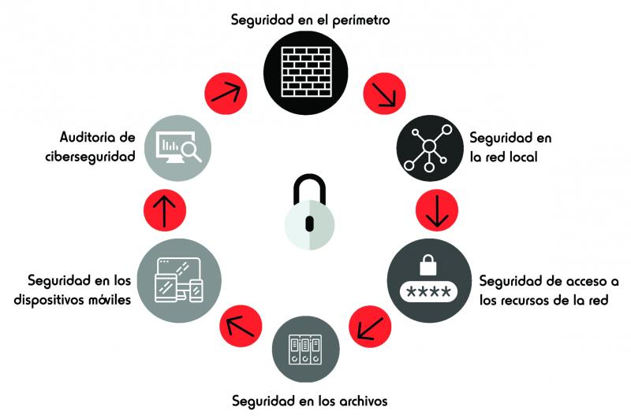

# TrueKhe

[Presentacion](https://www.canva.com/design/DADhjaY4Z7Q/zf3FAD5VVDuJbsPvfo6oqA/view?utm_content=DADhjaY4Z7Q&utm_campaign=designshare&utm_medium=link&utm_source=sharebutton#1)

## Road Map General

## Road Map de Seguridad

### Los datos por si mismos tienen un valor intrínsecos, por lo cual hay que asegurar la claridad en la estructura del sitio. Hay 3 características de la información que se deben mantener, que son : condidencialidad, integridad y disponibilidad; También se debe poder garantizar el acceso a los datos por medio de autenticación, autorización y auditoría, garantizando así la seguridad de los usuarios.

